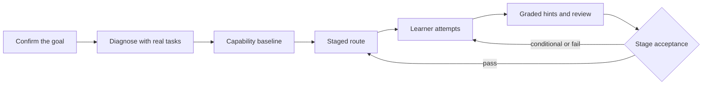

<p align="center">
  <strong>A project-based learning coach: the learner does the work, the coach runs the loop</strong><br/>
  A teaching skill and plugin bundle for <a href="https://github.com/deepseek-ai/deepseek-harness">DeepSeek Harness</a> (DSH) — teaching method and subject matter are separated, domain packs are swappable
</p>

<p align="center">
  <a href="README.md">简体中文</a> · <a href="README.en.md"><strong>English</strong></a>
</p>

<p align="center">
  <a href="https://www.npmjs.com/package/dsh-project-based-learning"></a>
  <a href="https://github.com/Kirisame1969/dsh-project-based-learning/actions"></a>
  <a href="LICENSE"></a>
  <a href="https://github.com/Kirisame1969/dsh-project-based-learning/stargazers"></a>
</p>

<p align="center">
  <a href="https://github.com/topics/dsh-plugin"></a>
  
</p>

<br/>

This project constrains AI tutoring into an **executable teaching protocol** that advances along a real project, and ships both as a DSH skill and as an installable plugin bundle.

- **Outputs**: a staged route, task cards, an evidence file (`.coach/state.json` as the single source of truth, `.coach/PROGRESS.md` rendered from it), and stage acceptance verdicts.
- **Enforced rules**: ability conclusions their evidence does not support are rejected; a stage cannot pass while blockers are open; subject-specific tokens must not appear in engine files.
- **How it is enforced**: a zero-dependency validator checks these rules mechanically, not merely in prose.
- **Subject decoupling**: the method lives in the engine, the knowledge lives in **swappable domain packs**; changing subject never requires touching the engine. The first pack ships in-repo: Unity / C#.

> **Naming**: the repository, the npm package and the registered skill all share one name, `dsh-project-based-learning` (the model invokes it as `skill("dsh-project-based-learning")`).

## 📐 Design stance

| Teaching problem | Treatment in this project |
|---|---|
| Factual knowledge and skills treated alike | Factual knowledge is **taught directly** (concept → why the current task needs it → minimal example → the learner applies it once → one confirmation question); scaffolding and graded hints are **for skills only** |
| Self-reports either believed blindly or dismissed | Three classes: an **ability** claim is a lead only; a **gap** claim is believed immediately and switches the coach into teaching; an **action** report is accepted as partially verified unless contradicted — no re-running demanded |
| One correct answer treated as mastery | Conclusions are layered by type: knowledge requires **explaining the mechanism unprompted and transferring it to a new situation**; behaviour requires reproducible material |
| Stage acceptance without criteria | A **three-tier verdict** (pass / conditional / fail) with a *reproducible + explainable + modifiable* sufficiency test |
| AI-written work counted as ability | AI-assisted work counts only after the learner can **explain, modify and verify** it |

## 🚫 What it is not

- **Not a question bank or a drill tool**: diagnostic questions locate and grade; they are not the teaching content.
- **Not a ghost-writing tool**: a full reference answer is given only on explicit request and never counts as evidence.
- **Not an official DeepSeek plugin**: this is a third-party implementation.
- **Not tied to a subject**: Unity / C# is the first domain pack shipped in-repo; it is not part of the engine.

## 🚀 Quick start

```bash
dsh plugin --profile web add dsh-project-based-learning
```

Then enter teaching mode explicitly in a session and name the subject:

> 教学模式：我完全没学过 <subject>，请评估我的水平

Replace `<subject>` with what you want to learn. When the missing piece is factual knowledge, the coach teaches first (concept → why the current task needs it → minimal example → you apply it once → one confirmation question) and only then returns to the route — instead of opening with a set of diagnostic questions.

The Unity / C# pack shipped in-repo is demonstrated in `skills/dsh-project-based-learning/references/domains/unity-csharp/example.md`.

## 📦 Install

### Option 1 — plugin bundle (recommended)

```bash
dsh plugin --profile web add dsh-project-based-learning     # or --profile headless, or your own profile
dsh --profile web --dump-config                             # the dsh-project-based-learning layer should appear
```

Without npm, install straight from this repository:

```bash
dsh plugin --profile web add github:Kirisame1969/dsh-project-based-learning
```

The bundle layer (`cordis.patch.yml`) registers the packaged skill through `ctx.skills.register()`. The plugin only consumes the `skills` service — it imports nothing from the harness and brings no second copy of Cordis.

Uninstall:

```bash
dsh plugin --profile web remove dsh-project-based-learning
```

Learning data lives in `.coach/` inside your workspace; uninstalling does not delete it.

### Option 2 — skill files only

Into any DSH skill root (project-scoped `.dsh/skills/`, or `$DSH_HOME/skills/` for every workspace):

```bash
npx -y -p dsh-project-based-learning coach-install --dest-root "$DSH_HOME/skills"
```

From a checkout, the same installer runs locally and supports `--dry-run`, `--link` and `--force`:

```bash
node skills/dsh-project-based-learning/scripts/coach-install.mjs --dry-run
node skills/dsh-project-based-learning/scripts/coach-install.mjs --dest-root "$DSH_HOME/skills"
```

### Option 3 — no install

Point your agent at `skills/dsh-project-based-learning/SKILL.md` and ask it to follow that file. Engine protocol, domain pack and scripts are plain files.

## 💬 Commands

| Command | Effect |
|---|---|
| `开始诊断` | Goal and experience intake, then a three-class minimum-coverage diagnostic |
| `制定路线` | Create or adjust the staged route |
| `本次任务：…` | One task loop (deliverable → attempt → hints → evidence) |
| `给提示，级别 N` | Only the requested hint level (1–5) |
| `审阅成果：…` | Review by severity, mechanism, impact, minimal fix, verification |
| `验收阶段` | Three-tier verdict, item-by-item checklist, retrieval recap |
| `复盘` | Capability delta, error patterns, next step |
| `调整节奏` | Re-plan by time or difficulty |
| `直接答案` | Full reference implementation (recorded as **not** evidence) |
| `查看学习档案` / `更新学习档案` | Read / write the state file and validate it |
| `切换或替换学科：<id>` | Switch domain pack; updates `state.domain` and `domainVersion`, keeps existing evidence |

The command vocabulary is Chinese today; the engine prose is subject-neutral, and translations are a welcome contribution.

## 🧩 How it works



```
skills/dsh-project-based-learning/
├── SKILL.md                            # engine: the loop, standing rules, command → file map
├── references/engine/                  # 9 protocol files, loaded on demand
├── references/domains/unity-csharp/    # the domain pack shipped in-repo (7 files)
├── assets/                             # state template + task / review / acceptance templates
└── scripts/                            # zero-dependency validator, regression selftest, installer
```

- **State**: `.coach/state.json` is the single source of truth; `.coach/PROGRESS.md` is rendered from it (never hand-edited).
- **The validator** checks the state file, the domain-pack contract, and one **layering rule**: engine files must contain no subject-specific tokens. Run it after every accepted action:

  ```bash
  node skills/dsh-project-based-learning/scripts/coach-validate.mjs --state .coach/state.json --render
  ```

## 🎛️ Subjects and domain packs

The engine is bound to no subject: it references a domain pack only by **section name and id**, and hard-codes no subject id. The active subject is the `domain` field in the state file.

<details>
<summary><b>The pack shipped in-repo: Unity / C#</b> (click to expand)</summary>

| File | Content |
|---|---|
| `manifest.yml` | `id: unity-csharp`, version, engine compatibility range, per-task time window `[30, 90]` minutes |
| `archetypes.md` | 6 project archetypes (stage split, minimum verifiable output, acceptance points, failure modes) |
| `diagnosis-bank.md` | 16 diagnostic questions across 7 dimensions; each labelled with a **type** (factual / reasoning / mixed) and its **prerequisites**; factual items never open first contact |
| `verification.md` | 5 executable check recipes (preconditions, command, expected output, meaning of failure, required sandbox mode) |
| `pitfalls.md` | Grouped pitfalls with symptom, mechanism, minimal fix and the capability dimension each maps to |
| `example.md` | One fully worked example: intake → capability profile → stages → review → acceptance verdict |
| `glossary.md` | Bilingual terminology table |

Commands marked「（未验证）」inside that pack must be confirmed on a machine with Unity Editor before they can support an acceptance verdict.

</details>

**Adding a subject pack** — two routes:

1. **Let the AI generate it** — say this in a session:

   > Following the contract in `references/engine/domain-contract.md`, generate a domain pack for "<subject>": create manifest.yml, archetypes.md, diagnosis-bank.md, verification.md, pitfalls.md, example.md and glossary.md under `references/domains/<id>/`; label diagnostic questions with type and prerequisites; validate with `coach-validate.mjs --domain-dir` when done.

2. **Write it by hand** — fill the same seven contract files; steps are in [`CONTRIBUTING.md`](CONTRIBUTING.md).

**Switching subject**: put the pack under `references/domains/<id>/`, then say `切换或替换学科：<id>`. The engine updates `state.domain` and `domainVersion` and records the reason in the route changes; **existing evidence and conclusions are kept** — only the route ahead and the question source change.

Three boundaries, stated plainly:

- When a pack lacks a section, the engine falls back to its generic behaviour and says so ("this pack does not provide X; using the generic approach this time").
- The validator only checks the keys of `manifest.yml` and the presence and size of section files; it does **not** parse the question bank. Field requirements on questions are a manual review item, not a mechanical gate.
- A domain pack must currently live under the skill's `references/domains/`; keeping packs in your workspace, or distributing them across repositories, is not supported yet.

## 📋 Requirements

- Node.js `^22.19.0 || >=24.0.0` (the scripts themselves need only `fs.cpSync`, available since 16.7; the plugin matrix matches the harness).
- No npm dependencies, no build step: `lib/index.js` is hand-written source, not a build artifact.

## 📚 Documentation

- [`docs/installing.zh.md`](docs/installing.zh.md) — installation details (native DSH / DSH Desktop / each skill root)
- [`CHANGELOG.md`](CHANGELOG.md) — version history
- [`CONTRIBUTING.md`](CONTRIBUTING.md) — how to add a domain pack

## 🤝 Contributing

The most valuable contribution is a **new domain pack**; start with [`CONTRIBUTING.md`](CONTRIBUTING.md).

## 📄 License

[MIT](LICENSE).
