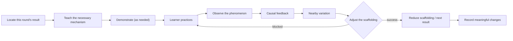

<p align="center">
  <strong>项目制教学教练：学员动手，教练跑闭环</strong><br/>
  面向 <a href="https://github.com/deepseek-ai/deepseek-harness">DeepSeek Harness</a>（DSH）的教学技能与组合包 —— 教学法与学科内容分离，领域导航可整体替换
</p>

<p align="center">
  <a href="README.md"><strong>简体中文</strong></a> · <a href="README.en.md">English</a>
</p>

<p align="center">
  <a href="https://www.npmjs.com/package/dsh-project-based-learning"></a>
  <a href="https://github.com/Kirisame1969/dsh-project-based-learning/actions"></a>
  <a href="https://img.shields.io/github/license/Kirisame1969/dsh-project-based-learning?style=for-the-badge&color=blue" alt="许可证" /></a>
  <a href="https://github.com/Kirisame1969/dsh-project-based-learning/stargazers"></a>
</p>

<p align="center">
  <a href="https://github.com/topics/dsh-plugin"></a>
  
</p>

<br/>

This project constrains "AI tutoring" into an **executable teaching protocol**: teaching is organized around the work the learner actually wants to finish, **explicit instruction** is a formal stage, and beginners first get an understanding sufficient to act, then practice in a real project as soon as possible.

- **Teach first, then practice**: for unfamiliar knowledge, explain the minimal necessary mechanism first instead of asking the learner to guess; theory covers only what the current step needs, then returns immediately to one real operation.
- **Explain in place**: new concepts, new built-in functions, and non-obvious syntax are explained **where they first appear**; do not translate an entire file line by line, and do not unfold a whole subject at once for the sake of "completeness".
- **Non-graded evidence**: only five descriptive concept states record the difference between "explained" and "already demonstrated through practice"; no numeric ability scores and no fixed-dimension grades are used.
- **Subject decoupling**: the pedagogy lives in the teaching engine, and subject knowledge lives in **domain navigations that can be replaced wholesale**; changing subject does not require changing the engine.

> **Naming**: the repository name, the npm package name, and the registered skill name are identical, all being `dsh-project-based-learning` (the model invokes it through `skill("dsh-project-based-learning")`).

## 📐 Design stance

| Teaching problem | How this project handles it |
|---|---|
| Factual knowledge and skills treated as one thing | Factual knowledge is **taught directly** (what it solves → how the current code uses it → what you will see → the single most relevant pitfall) |
| Learner self-reports always believed or never believed | Three kinds are handled separately: an **ability self-report** is only a clue; a **gap self-report** is believed directly and moves into instruction; an **operation self-report** is accepted when there is no contrary evidence, with no demand to repeat the measurement |
| Instruction mistaken for mastery | "Explained" can only be recorded as **taught, awaiting practice**; only real use, modification, debugging, or transfer raises the state |
| Example code doing the learner's work | A complete runnable demonstration is allowed (beginners need the overall structure), but after the demonstration the learner **must modify, explain, verify, or transfer** it |
| Explanation that never stops | After two or more core concepts explained in a row, or once the learner starts asking "when do we start doing it", **practice is forced** |
| One standard applied to every situation | Scaffolding follows the most recent real performance: more structure needed / partial release possible / open practice possible / transfer can be tested |

## 🚫 What it is not

- **Not a question bank or a drill tool**: a domain navigation gives only rough dependencies and threshold concepts; it contains no diagnostic question bank, no fixed lesson hours, and no standard answers.
- **Not a ghost-writing tool**: a review request does not automatically authorize modification; a teaching request does not automatically widen project write permission.
- **Not an official DeepSeek plugin**: this project is a third-party implementation.
- **Not limited to any subject**: two navigations ship with the package, Unity Shader and Unity C#; neither of them belongs to the engine.

## 🚀 Quick start

### Option 1: let DSH install it itself (recommended)

Copy the whole block below and paste it into any DSH session you are using — it installs the plugin itself and checks each item:

```text
Please install the DSH plugin dsh-project-based-learning (project-based teaching coach: skill + bundle). Steps:

1. Run: dsh plugin --profile web add dsh-project-based-learning
   (change the profile name to the one you actually use; the desktop default is web; if this fails or the installed version is below 3.0.0, use instead:
    dsh plugin --profile web add github:Kirisame1969/dsh-project-based-learning)
2. Run: dsh --profile web --dump-config and confirm that a dsh-project-based-learning layer appears in the output
3. Confirm the skill is registered: dsh-project-based-learning should appear in the skill catalog
4. Report back to me: the installed version, whether that layer exists, and whether the skill is available

If you hit an error, first read the "Installation details" section of the README at https://github.com/Kirisame1969/dsh-project-based-learning.
```

### Option 2: type one command yourself

```bash
dsh plugin --profile web add dsh-project-based-learning
```

Once it is installed, just say in the session what you want to learn; there are no command words to memorize:

> Teaching mode: I have never studied <topic> at all, please assess my level

The coach first decides which teaching lane to take, then **teaches the minimal mechanism the current step needs**, and then takes you to an observable result as soon as possible — instead of opening with a set of diagnostic questions.

The domain navigations shipped with the package are demonstrated in `skills/dsh-project-based-learning/references/domains/unity-shader.md` and `unity-csharp.md`.

## 📦 Installation details

### Bundle: install from npm or from GitHub

```bash
dsh plugin --profile web add dsh-project-based-learning     # or --profile headless, or your own profile
dsh --profile web --dump-config                             # the dsh-project-based-learning layer should appear
```

Without npm, install straight from this repository:

```bash
dsh plugin --profile web add github:Kirisame1969/dsh-project-based-learning
```

The bundle layer (`cordis.patch.yml`) registers the skill distributed with the package through `ctx.skills.register()`. The plugin only consumes the `skills` service — it imports nothing from the harness and brings no second copy of Cordis.

Uninstall:

```bash
dsh plugin --profile web remove dsh-project-based-learning
```

Learning data lives in `.learning/` inside your workspace; uninstalling the plugin does not delete it.

### No install at all

Point your agent at `skills/dsh-project-based-learning/SKILL.md` and ask it to follow that file. The teaching protocol, the domain navigations and the scripts are plain files.

## 🛣️ Teaching lanes

The skill automatically picks the **lightest** lane for the request; you do not need to memorize the categories:

| Lane | When it is taken | State file created |
|---|---|---|
| **Quick teaching** | Explain one concept or a piece of local code | No |
| **Single guided practice** | Produce a small result in one round or a few rounds | No by default |
| **Ongoing course** | Advance around a project across many rounds | **Yes** (`.learning/state.json`) |
| **Artifact review or debugging** | Check code, work, or a phenomenon you submit | No |
| **Milestone review** | You explicitly ask to review, accept, or adjust the route | No (reads existing state) |

When the intent is clear, start directly, without an entrance knowledge test. Ask only when the missing information would clearly change the technical approach, the project boundary, or the teaching method, and ask at most three questions per round.

## 🧩 How it works


```mermaid
flowchart LR
    A["Locate this round's result"] --> B["Teach the necessary mechanism"] --> C["Demonstrate (as needed)"]
    C --> D["Learner practices"] --> E["Observe the phenomenon"] --> F["Causal feedback"]
    F --> G["Nearby variation"] --> H{"Adjust the scaffolding"}
    H -->|success| I["Reduce scaffolding / next result"]
    H -->|blocked| D
    I --> J["Record meaningful changes"]
```

```
skills/dsh-project-based-learning/
├── SKILL.md                         # Entry: lanes, inviolable principles, default loop, output format, routing
├── references/
│   ├── teaching-loop.md             # Attention focus, teaching granularity, demonstration strength, practice design, questions, error correction, preventing theory drift
│   ├── planning-and-state.md        # Route granularity (now/next/later) and concept-state semantics
│   ├── review-and-adapt.md          # Artifact review, debugging as teaching, scaffolding adjustment, milestone review
│   ├── permissions.md               # Distinguishing request types, project write boundaries, evidence and privacy
│   ├── domain-guidance.md           # The contract for what a domain navigation "should contain / must not contain"
│   └── domains/
│       ├── index.md                 # Choose at most one relevant navigation
│       ├── unity-shader.md          # Unity Shader dependency graph, threshold concepts, risks, version check
│       └── unity-csharp.md          # Unity C# dependency graph, threshold concepts, risks, version check
├── assets/
│   ├── state.template.json          # 2.0 state template
│   └── lesson-note.md               # Optional single-lesson note template
└── scripts/
    ├── validate-learning-state.mjs  # Zero-dependency state validator
    └── migrate-v1-state.mjs         # One-time migration from the old 2.x state
```

- **Protocol loaded on demand**: `SKILL.md` references the detail files listed above only when needed, so the methodology of a whole course is not packed into every round's context.
- **The subject affects only the route**: a domain navigation provides rough dependencies and threshold concepts; the concrete explanations, examples, exercises and questions are **generated on the spot around the current work**.

## 🎛️ Domain navigations

The pedagogy is bound to no subject. A domain navigation is a **single-file, coarse-grained** dependency graph used to keep the route from losing order; it stores no course content — even with no navigation at all, the general teaching loop remains fully usable.

<details>
<summary><b>The two navigations shipped with the package</b> (click to expand)</summary>

| File | Coverage |
|---|---|
| `references/domains/unity-shader.md` | Shaders, materials, Sprite visual treatment, screen filters. Threshold concepts such as "a fragment / a screen pixel / a texel are not the same concept" and "UV is a coordinate, not a loop variable"; includes risks such as transparency render state, coordinate ratios and overdraw |
| `references/domains/unity-csharp.md` | C# game logic, the component model, scene organization, runtime debugging, project structure. Threshold concepts such as "a C# object / a component / a scene instance are not the same layer" and "the lifecycle is driven by Unity calls" |

Both write only "coverage, rough route, key threshold concepts, common misconceptions and risks, teaching stance, version check", and both require explicitly: do not force the learner through every prerequisite lesson just because the navigation lists a stage.

</details>

**Adding a domain navigation**: put a single file at `references/domains/<id>.md`, then add one line in `references/domains/index.md` pointing to it. The contract is in [`references/domain-guidance.md`](skills/dsh-project-based-learning/references/domain-guidance.md) and [`CONTRIBUTING.md`](CONTRIBUTING.md).

Three boundaries (stated plainly):

- A domain navigation **must not** contain a diagnostic question bank, fixed lesson hours, a prefabricated exercise list, an acceptance rubric or an exhaustive glossary — that would turn it into a course package.
- A domain navigation provides direction and dependencies only; skipping, merging, rolling back or reordering is decided by the current work and the existing evidence.
- A domain navigation must be located under `references/domains/` in the skill directory.

## 💾 State and migration

Only an **ongoing course** creates a state file. A quick question, a one-off term explanation and a single small exercise create no state.

The state path is `.learning/state.json`, and concepts use only five descriptive states (increasing in strength):

```text
尚未接触 (not yet encountered) → 已讲授待实践 (taught, awaiting practice) → 带练中 (guided practice) → 可在熟悉任务中独立使用 (usable independently in familiar tasks) → 已迁移到新任务 (transferred to a new task)
```

The last three states **must** have practice evidence; instruction or a demonstration alone does not count. The validator enforces this mechanically:

```bash
node skills/dsh-project-based-learning/scripts/validate-learning-state.mjs --state .learning/state.json
```

(The bundled CLI also works: `coach-validate --state .learning/state.json`.)

### Migrating from 2.x

3.0 is a **breaking change**: the state path, the state schema and the domain package structure are all incompatible with 2.x. The old `.coach/state.json` is handled by a one-time migration script:

```bash
node skills/dsh-project-based-learning/scripts/migrate-v1-state.mjs \
  --input .coach/state.json --output .learning/state.json
```

(Or `coach-migrate --input .coach/state.json --output .learning/state.json`.)

The migration trade-offs are **deliberate**:

- Keeps the goal, completion criteria, environment, non-goals, current task and route text, compressed into `now / next / later`.
- **Does not migrate numeric ability levels**, and does not automatically map the old "verified" status to any concept state; concept states must be re-established from actual course evidence.
- Records the migration source in `decisions` as a reminder to verify it manually in the next round; the migration result **must be reviewed by a human**.
- Migration is a one-time operation: a new course maintains only `.learning/state.json` and does not keep two sets of state in sync.

> ⚠️ The migration script is lossy. The old `strategy.assumptions` (which may contain format conventions issued by the learner), `open` (unresolved items), `authorizations` (authorized scope) and `routeChanges` are not carried into the 2.0 structure. If those are still valid, add them by hand to `preferences`, `decisions` and `context.exclusions` after migrating.

## 📋 Requirements

- Node.js `^22.19.0 || >=24.0.0` (the validation and migration scripts need a Node with ESM support; teaching itself does not).
- No npm dependencies, no build step: `lib/index.js` is hand-written source, not a build artifact.

## 📚 Documentation

- [`CHANGELOG.md`](CHANGELOG.md) — version changes
- [`CONTRIBUTING.md`](CONTRIBUTING.md) — how to add a domain navigation
- `references/domain-guidance.md` — the domain navigation contract

## 🤝 Contributing

The most valuable contribution is **adding a subject domain navigation**; start with [`CONTRIBUTING.md`](CONTRIBUTING.md).

## 📄 License

[MIT](LICENSE).
