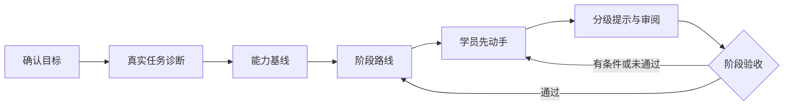

<p align="center">
  <strong>项目制学习教练：学员动手，教练跑闭环</strong><br/>
  面向 <a href="https://github.com/deepseek-ai/deepseek-harness">DeepSeek Harness</a>（DSH）的教学技能与组合包 —— 教学法与学科内容分离，领域包可整体替换
</p>

<p align="center">
  <a href="README.md"><strong>简体中文</strong></a> · <a href="README.en.md">English</a>
</p>

<p align="center">
  <a href="https://www.npmjs.com/package/dsh-project-based-learning"></a>
  <a href="https://github.com/Kirisame1969/dsh-project-based-learning/actions"></a>
  <a href="LICENSE"></a>
  <a href="https://github.com/Kirisame1969/dsh-project-based-learning/stargazers"></a>
</p>

<p align="center">
  <a href="https://github.com/topics/dsh-plugin"></a>
  
</p>

<br/>

本项目把「AI 辅导」约束成一套**可执行的教学协议**，以真实项目为主线推进教学，并以 DSH 技能与可安装组合包两种形态分发。

- **产出物**：分阶段路线、任务卡、证据档案（`.coach/state.json` 为唯一事实源，`.coach/PROGRESS.md` 为生成视图）、阶段验收结论。
- **强制规则**：证据不支撑的能力结论被拒绝；存在未解决阻塞项时阶段不能判通过；学科专有词不得出现在引擎文件中。
- **执行方式**：上述规则由零依赖校验器机械检查，不只写在提示词里。
- **学科解耦**：教学法在引擎中，学科知识在**可整体替换的领域包**中；换学科不需要改引擎。随包提供第一个领域包：Unity / C#。

> **命名**：仓库名、npm 包名、技能注册名三者一致，均为 `dsh-project-based-learning`（模型侧通过 `skill("dsh-project-based-learning")` 调用）。

## 📐 设计取向

| 教学问题 | 本项目的处理 |
|---|---|
| 事实性知识与技能混为一谈 | 事实性知识**直接讲授**（概念 → 为什么当前任务需要它 → 最小示例 → 学员应用一次 → 一道确认题）；脚手架与分级提示**只用于技能** |
| 学员自述被一律采信或不采信 | 三类分别处理：**能力自述**仅作线索；**缺口自述**直接采信并转入讲授；**操作自述**无反证时按部分验证接受，不要求重复实测 |
| 单题答对即认定掌握 | 结论按类型分层：知识类要求**无提示解释机制并迁移到新情境**；行为类要求可复现材料 |
| 阶段验收缺少判据 | **三档结论**（通过／有条件通过／未通过），证据充分性判据为「可复现 + 可解释 + 可修改」 |
| AI 代写被计入能力 | AI 参与的成果，须由学员**解释、修改、验证**后才计为能力证据 |

## 🚫 它不是什么

- **不是题库或刷题工具**：诊断题只用于定位与分级，不作为教学内容。
- **不是代写工具**：完整参考答案仅在明确请求时给出，且不计入能力证据。
- **不是官方 DeepSeek 插件**：本项目为第三方实现。
- **不限定学科**：Unity / C# 是随包提供的第一个领域包，不属于引擎。

## 🚀 快速开始

```bash
dsh plugin --profile web add dsh-project-based-learning
```

在会话中显式进入教学模式，并给出要学的主题：

> 教学模式：我完全没学过 <主题>，请评估我的水平

把 `<主题>` 换成你要学的内容即可。遇到事实性知识缺口时，教练会先讲授（概念 → 为什么当前任务需要它 → 最小示例 → 你应用一次 → 一道确认题），再回到路线安排，而不是先出一组诊断题。

随包提供的 Unity / C# 领域包示范见 `skills/dsh-project-based-learning/references/domains/unity-csharp/example.md`。

## 📦 安装

### 方式一：组合包（推荐）

```bash
dsh plugin --profile web add dsh-project-based-learning     # 也可用 --profile headless 或你自己的 profile
dsh --profile web --dump-config                             # 应出现 dsh-project-based-learning 层
```

不经 npm，直接从本仓库安装：

```bash
dsh plugin --profile web add github:Kirisame1969/dsh-project-based-learning
```

组合包层（`cordis.patch.yml`）通过 `ctx.skills.register()` 注册随包分发的技能。插件只消费 `skills` 服务，不 import 任何 harness 包，也不会带进第二份 Cordis。

卸载：

```bash
dsh plugin --profile web remove dsh-project-based-learning
```

学习数据位于工作区的 `.coach/`，卸载技能不会删除它。

### 方式二：只装技能文件

装进任意 DSH 技能根（项目级 `.dsh/skills/`，或用户级 `$DSH_HOME/skills/`）：

```bash
npx -y -p dsh-project-based-learning coach-install --dest-root "$DSH_HOME/skills"
```

若已有本仓库检出，可直接运行同一个安装器，支持 `--dry-run`、`--link` 与 `--force`：

```powershell
node skills\dsh-project-based-learning\scripts\coach-install.mjs --dry-run
node skills\dsh-project-based-learning\scripts\coach-install.mjs --dest-root "$env:DSH_HOME\skills"
```

### 方式三：不安装

将 agent 指向 `skills/dsh-project-based-learning/SKILL.md`，令其按该文件执行。引擎协议、领域包与脚本均为普通文件。

## 💬 指令手册

| 指令 | 作用 |
|---|---|
| `开始诊断` | 收集目标与经验，做三类最小覆盖诊断 |
| `制定路线` | 生成 / 调整阶段路线 |
| `本次任务：…` | 进入单次任务循环（交付物 → 尝试 → 提示 → 证据） |
| `给提示，级别 N` | 只给指定级别的提示（1–5） |
| `审阅成果：…` | 按严重度、机制、影响、最小修法、验证方式审阅 |
| `验收阶段` | 三档结论、逐项核对、检索式复述 |
| `复盘` | 能力变化 / 错误模式 / 下一步 |
| `调整节奏` | 按时间或难度调整路线 |
| `直接答案` | 给出完整参考实现（记录为**不计**能力证据） |
| `查看学习档案` / `更新学习档案` | 读 / 写状态并校验 |
| `切换或替换学科：<id>` | 更换领域包，更新 `state.domain` 与 `domainVersion`，保留既有证据 |

指令词目前为中文；引擎正文与学科无关，翻译属于受欢迎的贡献。

## 🧩 工作原理



```
skills/dsh-project-based-learning/
├── SKILL.md                            # 引擎：闭环、常驻规则、指令 → 必读文件映射
├── references/engine/                  # 9 个协议文件，按需加载
├── references/domains/unity-csharp/    # 随包提供的领域包（7 个文件）
├── assets/                             # 状态模板 + 任务卡 / 审阅 / 验收模板
└── scripts/                            # 零依赖校验器、回归自测、安装器
```

- **状态**：`.coach/state.json` 为唯一事实源，`.coach/PROGRESS.md` 由其渲染（禁止手工编辑）。
- **校验器**检查状态文件、领域包契约，以及一条**分层规则**：引擎文件中不得出现学科专有词条。每次可验收动作后运行：

  ```bash
  node skills/dsh-project-based-learning/scripts/coach-validate.mjs --state .coach/state.json --render
  ```

## 🎛️ 学科与领域包

引擎不绑定任何学科：它只用**小节名与 id** 引用领域包，不硬编码学科 id。当前学科由状态文件的 `domain` 字段决定。

<details>
<summary><b>随包提供的领域包：Unity / C#</b>（点击展开）</summary>

| 文件 | 内容 |
|---|---|
| `manifest.yml` | `id: unity-csharp`、版本、引擎兼容范围、单次任务时长区间 `[30, 90]` 分钟 |
| `archetypes.md` | 6 个项目原型（阶段切分、最小可验证成果、验收要点、失败模式） |
| `diagnosis-bank.md` | 16 道诊断题，覆盖 7 个维度；每题标注**类型**（事实性／推理性／综合）与**前置知识**，事实性题不作首次接触题 |
| `verification.md` | 5 条可执行核对配方（前置条件、命令、期望输出、失败含义、所需沙箱模式） |
| `pitfalls.md` | 陷阱分组的症状、机制、最小修复与对应能力维度 |
| `example.md` | 一份填好的完整示例：intake → 能力画像 → 阶段 → 审阅 → 验收结论 |
| `glossary.md` | 中英对照术语表 |

该包内标注「（未验证）」的命令，需在装有 Unity Editor 的环境实测确认后才可用于验收判定。

</details>

**新增一个学科包**，两条路径：

1. **让 AI 生成**——在会话中直接说：

   > 按 `references/engine/domain-contract.md` 的契约，为「<学科>」生成领域包：在 `references/domains/<id>/` 下建立 manifest.yml、archetypes.md、diagnosis-bank.md、verification.md、pitfalls.md、example.md、glossary.md 七个文件；诊断题标注类型与前置知识；生成后用 `coach-validate.mjs --domain-dir` 校验。

2. **手工编写**——按同一份契约补齐七个文件，步骤见 [`CONTRIBUTING.md`](CONTRIBUTING.md)。

**切换学科**：把包放入 `references/domains/<id>/`，然后说 `切换或替换学科：<id>`。引擎会更新 `state.domain` 与 `domainVersion` 并在路线变更中记录原因；**已完成的能力证据与结论保留**，只影响后续路线与题目来源。

三点边界（如实声明）：

- 领域包缺某个小节时，引擎回退到通用行为，并在回复中说明「该学科包未提供 X，本次按通用做法处理」。
- 校验器只检查 `manifest.yml` 的键、小节文件是否存在与大小，**不解析题库内容**；题目的字段要求属于人工核对项，不是机械门禁。
- 领域包目前必须位于技能目录的 `references/domains/` 下；把领域包放在工作区、或跨仓库分发领域包，尚无支持。

## 📋 环境要求

- Node.js `^22.19.0 || >=24.0.0`（脚本本身仅需 ≥ 16.7 的 `fs.cpSync`；插件矩阵与 harness 对齐）。
- 无 npm 依赖、无构建步骤：`lib/index.js` 为手写来源，不是构建产物。

## 📚 文档

- [`docs/installing.zh.md`](docs/installing.zh.md) —— 安装细则（原生 DSH / DSH Desktop / 各技能根）
- [`CHANGELOG.md`](CHANGELOG.md) —— 版本变更
- [`CONTRIBUTING.md`](CONTRIBUTING.md) —— 新增领域包的方法

## 🤝 贡献

最有价值的贡献是**新增一个学科领域包**，请先阅读 [`CONTRIBUTING.md`](CONTRIBUTING.md)。

## 📄 许可

[MIT](LICENSE)。
