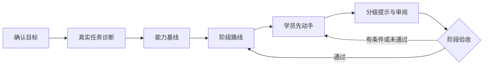

<p align="center">
  <strong>项目制学习教练 —— 学员动手，教练跑闭环</strong><br/>
  面向 <a href="https://github.com/deepseek-ai/deepseek-harness">DeepSeek Harness</a>（DSH）的教学引擎：学科无关，领域包可整体替换（内置 Unity / C#）
</p>

<p align="center">
  <a href="README.md"><strong>简体中文</strong></a> · <a href="README.en.md">English</a>
</p>

<p align="center">
  <a href="https://www.npmjs.com/package/dsh-project-based-learning"></a>
  <a href="https://github.com/Kirisame1969/dsh-project-based-learning/actions"></a>
  <a href="LICENSE"></a>
  <a href="https://github.com/Kirisame1969/dsh-project-based-learning/stargazers"></a>
</p>

<p align="center">
  <a href="https://github.com/topics/dsh-plugin"></a>
  
</p>

<br/>

**dsh-coach** 是一套跑在 DSH 里的**项目制教学协议**。它不讲课，而是围绕你的真实项目跑一条闭环：确认目标 → 用真实任务做诊断 → 建立有证据支撑的能力基线 → 定阶段可交付成果 → **让你先动手** → 用分级问题审阅 → 依据证据判阶段通过与否。

教学内容与引擎分离：教学法写在引擎里，学科知识住在**可整体替换的领域包**里（内置 Unity / C#，换学科不必改引擎）。

## 🚀 快速开始

```bash
dsh plugin --profile web add dsh-project-based-learning
```

装好后，在会话里说一句就能开始：

> 教学模式：我完全没学过 Unity 的生命周期，请评估我的水平

教练会**先把生命周期讲清楚**（概念 → 为什么你的任务需要它 → 最小示例 → 你亲自用一次 → 一道确认题），再谈路线；而不是先出一堆题考你。

## ✨ 与常见 AI 辅导有什么不同

| 常见做法 | dsh-coach |
|---|---|
| 从零照本宣科讲一章 | **学员先尝试**：完整答案是最后手段，不是第一步 |
| 一次把答案给到底 | **提示分级 1–5**，未经请求跳到满级是禁止的 |
| 你说"我没学过 X"，它先考你一遍 | **缺口自述直接采信**，立刻转入讲授 |
| 你答对概念题，它还要你跑一遍、补截图 | 知识类证据看**无提示解释机制 + 迁移到新情境**；操作自述无反证时按部分验证接受，**不要求重跑** |
| AI 写完就算你学会了 | 只有你能**解释、修改、验证**之后，AI 参与的成果才算能力证据 |
| 阶段验收凭感觉 | **三档结论**（通过 / 有条件通过 / 未通过）＋"可复现 + 可解释 + 可修改"判据 |

这些规则不只是文字：一个**零依赖校验器**会在你的状态文件上机械地执行它们——证据不支撑的能力结论会被拒绝，存在未解决阻塞项时阶段不能判通过。

## 📦 安装

### 方式一：组合包（推荐）

```bash
dsh plugin --profile web add dsh-project-based-learning     # 也可用 --profile headless 或你自己的 profile
dsh --profile web --dump-config                             # 应出现 dsh-project-based-learning 层
```

不经 npm，直接从仓库安装：

```bash
dsh plugin --profile web add github:Kirisame1969/dsh-project-based-learning
```

组合包层（`cordis.patch.yml`）通过 `ctx.skills.register()` 注册随包分发的技能。插件只消费 `skills` 服务，不 import 任何 harness 包，也不会带进第二份 Cordis。

### 方式二：只装技能文件

装进任意技能根（项目级 `.dsh/skills/`，或用户级 `$DSH_HOME/skills/`）：

```bash
npx -y -p dsh-project-based-learning coach-install --dest-root "$DSH_HOME/skills"
```

若已有本仓库检出，可直接运行同一个安装器，支持 `--dry-run`、`--link` 与 `--force`：

```powershell
node skills\dsh-coach\scripts\coach-install.mjs --dry-run
node skills\dsh-coach\scripts\coach-install.mjs --dest-root "$env:DSH_HOME\skills"
```

### 方式三：完全不安装

把 agent 指向 `skills/dsh-coach/SKILL.md`，让它按该文件执行。所有内容（引擎协议、领域包、脚本）都是普通文件。

## 💬 指令手册

| 指令 | 作用 |
|---|---|
| `开始诊断` | 收集目标与经验，做三类最小覆盖诊断 |
| `制定路线` | 生成 / 调整阶段路线 |
| `本次任务：…` | 进入单次任务循环（交付物 → 尝试 → 提示 → 证据） |
| `给提示，级别 N` | 只给指定级别的提示（1–5） |
| `审阅成果：…` | 按严重度 + 机制 + 影响 + 最小修法 + 验证方式审阅 |
| `验收阶段` | 三档结论 + 逐项核对 + 检索式复述 |
| `复盘` | 能力变化 / 错误模式 / 下一步 |
| `调整节奏` | 按时间或难度调整路线 |
| `直接答案` | 给完整参考实现（记录为**不计**能力证据） |
| `查看学习档案` / `更新学习档案` | 读 / 写状态并校验 |

指令词目前是中文。引擎正文与学科无关，翻译它是受欢迎的贡献。

## 🧩 工作原理



```
skills/dsh-coach/
├── SKILL.md                            # 引擎：闭环、常驻规则、指令 → 必读文件映射
├── references/engine/                  # 9 个协议文件，按需加载
├── references/domains/unity-csharp/    # 可替换的学科包（7 个文件）
├── assets/                             # 状态模板 + 任务卡 / 审阅 / 验收模板
└── scripts/                            # 零依赖校验器、回归自测、安装器
```

- **状态**在 `.coach/state.json`——唯一事实源；`.coach/PROGRESS.md` 由它渲染而来（**禁止手工编辑**）。
- **校验器**检查状态文件、领域包契约，以及一条**分层规则**：引擎文件中不得出现学科专有词条。每次可验收动作后运行：

  ```bash
  node skills/dsh-coach/scripts/coach-validate.mjs --state .coach/state.json --render
  ```

## 🔄 换一门学科

引擎学科无关；换学科**不需要改引擎**。新增 `references/domains/<new-id>/` 七个文件并按契约填 `manifest.yml` 即可——步骤见 [`CONTRIBUTING.md`](CONTRIBUTING.md) 与 `skills/dsh-coach/references/engine/domain-contract.md`。

## 📋 环境要求

- Node.js `^22.19.0 || >=24.0.0`（脚本本身只需 ≥ 16.7 的 `fs.cpSync`；插件矩阵与 harness 对齐）。
- 无 npm 依赖、无构建步骤。`lib/index.js` 是手写来源，不是构建产物。

## 📚 文档

- [`docs/installing.zh.md`](docs/installing.zh.md) —— 安装细则（原生 DSH / DSH Desktop / 各技能根）
- [`CHANGELOG.md`](CHANGELOG.md) —— 版本变更
- [`CONTRIBUTING.md`](CONTRIBUTING.md) —— 如何新增领域包

## 🤝 贡献

最受欢迎的贡献是**新增一个学科领域包**。请先读 [`CONTRIBUTING.md`](CONTRIBUTING.md)。

## 📄 许可

[MIT](LICENSE)。
