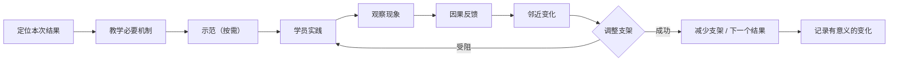

<p align="center">
  <strong>项目制教学教练：学员动手，教练跑闭环</strong><br/>
  面向 <a href="https://github.com/deepseek-ai/deepseek-harness">DeepSeek Harness</a>（DSH）的教学技能与组合包 —— 教学法与学科内容分离，领域导航可整体替换
</p>

<p align="center">
  <a href="README.md"><strong>简体中文</strong></a> · <a href="README.en.md">English</a>
</p>

<p align="center">
  <a href="https://www.npmjs.com/package/dsh-project-based-learning"></a>
  <a href="https://github.com/Kirisame1969/dsh-project-based-learning/actions"></a>
  <a href="https://img.shields.io/github/license/Kirisame1969/dsh-project-based-learning?style=for-the-badge&color=blue" alt="许可证" /></a>
  <a href="https://github.com/Kirisame1969/dsh-project-based-learning/stargazers"></a>
</p>

<p align="center">
  <a href="https://github.com/topics/dsh-plugin"></a>
  
</p>

<br/>

本项目把「AI 辅导」约束成一套**可执行的教学协议**：围绕学习者真正想完成的作品组织教学，把**明确讲授**作为正式环节，让初学者先获得足以行动的理解，再尽快在真实项目中实践。

- **先教学，后实践**：陌生知识先讲最小必要机制，不要求学员猜测；理论只覆盖当前步骤所需内容，然后立刻回到一次真实操作。
- **就地解释**：新概念、新内置函数和非显然语法在**首次使用处**说明，不逐行翻译整个文件，也不为「完整」一次展开整门学科。
- **非评分式证据**：只用五档描述性概念状态记录「讲过」与「已经通过实践展示」的区别，不使用数字能力分或固定维度等级。
- **学科解耦**：教学法在教学引擎中，学科知识在**可整体替换的领域导航**中；换学科不需要改引擎。

> **命名**：仓库名、npm 包名、技能注册名三者一致，均为 `dsh-project-based-learning`（模型侧通过 `skill("dsh-project-based-learning")` 调用）。

## 📐 设计取向

| 教学问题 | 本项目的处理 |
|---|---|
| 事实性知识与技能混为一谈 | 事实性知识**直接讲授**（它解决什么 → 当前代码怎样用它 → 会看到什么 → 最相关的一个坑） |
| 学员自述被一律采信或不采信 | 三类分别处理：**能力自述**仅作线索；**缺口自述**直接采信并转入讲授；**操作自述**无反证时接受，不要求重复实测 |
| 讲授被当成掌握 | 「讲过」只能记为**已讲授待实践**；只有真实使用、修改、排错或迁移才提高状态 |
| 示例代码替学员代劳 | 允许完整可运行示范（初学者需要整体结构），但示范后必须让学员**修改、解释、验证或迁移** |
| 一讲就停不下来 | 连续解释两个以上核心概念、或学员开始追问「什么时候开始做」时，**强制转入实践** |
| 用同一套标准衡量所有情况 | 支架按最近的真实表现调整：需要更多结构 / 可以局部放手 / 可以开放实践 / 可以检验迁移 |

## 🚫 它不是什么

- **不是题库或刷题工具**：领域导航只给粗略依赖与门槛概念，不含诊断题库、固定课时或标准答案。
- **不是代写工具**：审阅请求不自动授权修改；教学请求也不自动扩大项目写权限。
- **不是官方 DeepSeek 插件**：本项目为第三方实现。
- **不限定学科**：随包提供 Unity Shader 与 Unity C# 两份导航，它们都不属于引擎。

## 🚀 快速开始

### 方式一：让 DSH 自己装（推荐）

复制下面整段，粘给你正在用的任意一个 DSH 会话——它会自己安装并逐项核对：

```text
请帮我安装 DSH 插件 dsh-project-based-learning（项目制教学教练：技能 + 组合包）。步骤：

1. 执行：dsh plugin --profile web add dsh-project-based-learning
   （profile 名按你实际使用的改，桌面端默认是 web；若失败或装到的版本低于 3.0.0，改用：
    dsh plugin --profile web add github:Kirisame1969/dsh-project-based-learning）
2. 执行：dsh --profile web --dump-config，确认输出里出现 dsh-project-based-learning 层
3. 确认技能已注册：技能目录里应出现 dsh-project-based-learning
4. 向我报告：装到的版本、该层是否存在、技能是否可用

遇到报错先读 https://github.com/Kirisame1969/dsh-project-based-learning 的 README「安装细节」一节。
```

### 方式二：自己敲一条命令

```bash
dsh plugin --profile web add dsh-project-based-learning
```

装好后在会话里直接说明要学什么即可，不需要记指令词：

> 教学模式：我完全没学过 <主题>，请评估我的水平

教练会先判断该走哪条教学车道，然后**先讲授当前必要的最小机制**，再尽快带你做出一个可观察的结果——而不是先甩一组诊断题。

随包提供的领域导航示范见 `skills/dsh-project-based-learning/references/domains/unity-shader.md` 与 `unity-csharp.md`。

## 📦 安装细节

### 组合包：从 npm 或 GitHub 安装

```bash
dsh plugin --profile web add dsh-project-based-learning     # 也可用 --profile headless 或你自己的 profile
dsh --profile web --dump-config                             # 应出现 dsh-project-based-learning 层
```

不经 npm，直接从本仓库安装：

```bash
dsh plugin --profile web add github:Kirisame1969/dsh-project-based-learning
```

组合包层（`cordis.patch.yml`）通过 `ctx.skills.register()` 注册随包分发的技能。插件只消费 `skills` 服务，不 import 任何 harness 包，也不会带进第二份 Cordis。

卸载：

```bash
dsh plugin --profile web remove dsh-project-based-learning
```

学习数据位于工作区的 `.learning/`，卸载插件不会删除它。

### 完全不安装

将 agent 指向 `skills/dsh-project-based-learning/SKILL.md`，令其按该文件执行。教学协议、领域导航与脚本均为普通文件。

## 🛣️ 教学车道

技能按请求自动选择**最轻**的一条车道，不需要你记住分类：

| 车道 | 何时走 | 是否建档 |
|---|---|---|
| **快速教学** | 解释一个概念或局部代码 | 否 |
| **单次带练** | 一次或少数几轮里做出一个小结果 | 默认否 |
| **持续课程** | 围绕项目跨多轮推进 | **是**（`.learning/state.json`） |
| **成果审阅或排错** | 检查你提交的代码、作品或现象 | 否 |
| **里程碑回顾** | 你明确要求回顾、验收或调整路线 | 否（读已有状态） |

意图清楚时直接开始，不先做知识考试。只有缺失信息会明显改变技术方案、项目边界或教学方式时才提问，且每轮最多问三个。

## 🧩 工作原理


```mermaid
flowchart LR
    A["定位本次结果"] --> B["教学必要机制"] --> C["示范（按需）"]
    C --> D["学员实践"] --> E["观察现象"] --> F["因果反馈"]
    F --> G["邻近变化"] --> H{"调整支架"}
    H -->|成功| I["减少支架 / 下一个结果"]
    H -->|受阻| D
    I --> J["记录有意义的变化"]
```

```
skills/dsh-project-based-learning/
├── SKILL.md                         # 入口：车道、不可违背原则、默认循环、输出方式、路由
├── references/
│   ├── teaching-loop.md             # 注意力焦点、教学粒度、示范强度、实践设计、提问、纠错、防理论漂移
│   ├── planning-and-state.md        # 路线粒度（now/next/later）与概念状态语义
│   ├── review-and-adapt.md          # 成果审阅、把排错当教学、支架调整、里程碑回顾
│   ├── permissions.md               # 请求类型区分、项目写边界、证据与隐私
│   ├── domain-guidance.md           # 领域导航「应包含 / 不得包含」的契约
│   └── domains/
│       ├── index.md                 # 选择至多一份相关导航
│       ├── unity-shader.md          # Unity Shader 依赖图、门槛概念、风险、版本核对
│       └── unity-csharp.md          # Unity C# 依赖图、门槛概念、风险、版本核对
├── assets/
│   ├── state.template.json          # 2.0 状态模板
│   └── lesson-note.md               # 可选的单课记录模板
└── scripts/
    ├── validate-learning-state.mjs  # 零依赖状态校验器
    └── migrate-v1-state.mjs         # 从 2.x 旧状态一次性迁移
```

- **协议按需加载**：`SKILL.md` 只在需要时引用上表的详细文件，避免把整门课的方法论塞进每一轮上下文。
- **学科只影响路线**：领域导航提供粗略依赖与门槛概念；具体讲解、示例、练习和问题**围绕当前作品即时生成**。

## 🎛️ 领域导航

教学法不绑定任何学科。领域导航是**单文件、粗粒度**的依赖图，用来避免路线失序，不储存课程正文——即使一份导航都没有，通用教学循环依然完整可用。

<details>
<summary><b>随包提供的两份导航</b>（点击展开）</summary>

| 文件 | 覆盖范围 |
|---|---|
| `references/domains/unity-shader.md` | Shader、材质、Sprite 视觉处理、屏幕滤镜。门槛概念如「片元 / 屏幕像素 / 纹素不是同一个概念」「UV 是坐标不是循环变量」；含透明渲染状态、坐标比例、过度绘制等风险 |
| `references/domains/unity-csharp.md` | C# 游戏逻辑、组件模型、场景组织、运行时调试、项目结构。门槛概念如「C# 对象 / 组件 / 场景实例不是同一层」「生命周期由 Unity 调用」 |

两份都只写「覆盖范围、粗略路线、关键门槛概念、常见误区与风险、教学取向、版本核对」，并明确要求：不要因为导航列了某阶段就强迫学习者完成全部前置课时。

</details>

**新增一份领域导航**：在 `references/domains/<id>.md` 放一个单文件，然后在 `references/domains/index.md` 加一行指向它。契约见 [`references/domain-guidance.md`](skills/dsh-project-based-learning/references/domain-guidance.md) 与 [`CONTRIBUTING.md`](CONTRIBUTING.md)。

三条边界（如实声明）：

- 领域导航**不得**包含诊断题库、固定课时、预制练习清单、验收量表或穷举式术语表——那会把它变成课程包。
- 领域导航只提供方向和依赖；跳过、合并、回退或改序由当前作品与已有证据决定。
- 领域导航必须位于技能目录的 `references/domains/` 下。

## 💾 状态与迁移

只有**持续课程**才建档。快速问答、一次术语解释和单次小练习都不创建状态。

状态路径为 `.learning/state.json`，概念只使用五档描述性状态（强度递增）：

```text
尚未接触 → 已讲授待实践 → 带练中 → 可在熟悉任务中独立使用 → 已迁移到新任务
```

后三档**必须**有实践证据；讲授或示例本身不算。校验器会机械地把关：

```bash
node skills/dsh-project-based-learning/scripts/validate-learning-state.mjs --state .learning/state.json
```

（也可用随包 CLI：`coach-validate --state .learning/state.json`。）

### 从 2.x 迁移

3.0 是**破坏性变更**：状态路径、状态 schema 与领域包结构都与 2.x 不兼容。旧版 `.coach/state.json` 用一次性迁移脚本处理：

```bash
node skills/dsh-project-based-learning/scripts/migrate-v1-state.mjs \
  --input .coach/state.json --output .learning/state.json
```

（或 `coach-migrate --input .coach/state.json --output .learning/state.json`。）

迁移的取舍是**刻意**的：

- 保留目标、完成判据、环境、非目标、当前任务与路线文字，并压缩为 `now / next / later`。
- **不迁移数字能力等级**，也不把旧「已验证」自动映射为任何概念状态；概念状态需要根据实际课程证据重新建立。
- 在 `decisions` 中记录迁移来源，提醒下一轮人工核对；迁移结果**必须人工复核**。
- 迁移是一次性操作：新课程只维护 `.learning/state.json`，不保持两套状态同步。

> ⚠️ 迁移脚本是有损的。旧版 `strategy.assumptions`（可能含学员下发的格式约定）、`open`（未解决事项）、`authorizations`（授权范围）与 `routeChanges` 不会被搬进 2.0 结构。若这些内容仍然有效，请在迁移后手工补进 `preferences`、`decisions` 与 `context.exclusions`。

## 📋 环境要求

- Node.js `^22.19.0 || >=24.0.0`（校验与迁移脚本需要 ESM 支持的 Node；教学本身不需要）。
- 无 npm 依赖、无构建步骤：`lib/index.js` 为手写来源，不是构建产物。

## 📚 文档

- [`CHANGELOG.md`](CHANGELOG.md) —— 版本变更
- [`CONTRIBUTING.md`](CONTRIBUTING.md) —— 新增领域导航的方法
- [`docs/releasing.zh.md`](docs/releasing.zh.md) —— 发布清单与本机通道实测结论
- `references/domain-guidance.md` —— 领域导航契约

## 🤝 贡献

最有价值的贡献是**新增一份学科领域导航**，请先阅读 [`CONTRIBUTING.md`](CONTRIBUTING.md)。

## 📄 许可

[MIT](LICENSE)。
